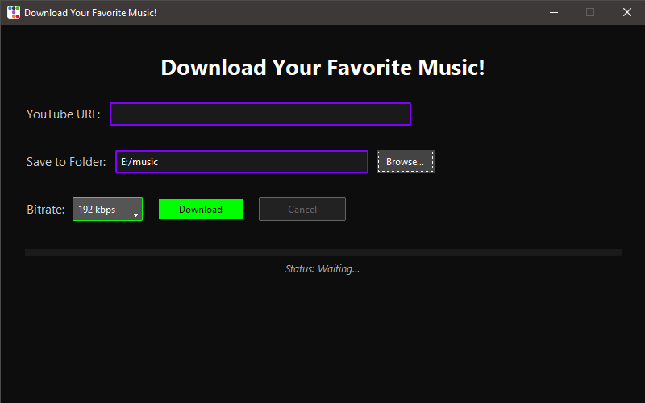
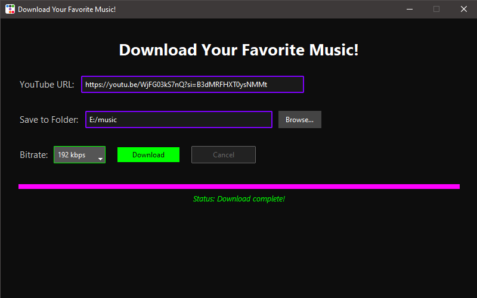

# YT Music Downloader

🎶 **YT Music Downloader** is a fast, beautiful, and lightweight music downloader for YouTube.  
Designed with a clean matte black dark mode and neon glow accents, it lets you download your favorite tracks with just one click.

---

---

## ✨ Features

- ✅ Download music from YouTube videos and playlists
- ✅ Choose your desired bitrate: 128kbps, 192kbps, or 320kbps
- ✅ Neon-themed UI with smooth progress animations
- ✅ Save downloaded MP3 files to any folder
- ✅ No console windows – pure modern desktop feel
- ✅ Clean, lightweight `.exe` installer with custom icon and setup wizard
- ✅ Start Menu shortcuts, Desktop shortcuts, and clean uninstallation support

---

## 📥 How to Install

1. Download the latest setup file from [Releases](https://github.com/ArielTav/ytmusicdownloader/releases).
2. Run the installer `ytmusicdownloader-setup.exe`.
3. Follow the easy install wizard.
4. After installation, launch **YT Music Downloader** from the Start Menu or Desktop!

---

## 🚀 Usage

1. Paste any YouTube link into the URL field.
2. Choose your desired audio quality (128kbps / 192kbps / 320kbps).
3. Select the destination folder.
4. Click **Download** — enjoy your music offline!

---

## 🛠 Requirements

- Windows 10 or later (64-bit)
- Internet connection (for downloads)

---

## 📸 Screenshots

| UI Preview | Download Progress |
|:---|:---|
|  |  |

*(Optional: Upload your screenshots to GitHub first and fix links.)*

---

## 📝 License

This application is provided for personal use only.  
All rights reserved to the creator (ArielTav).

---

## 🙌 Acknowledgments

- Developed using Python 3 and TTKBootstrap.
- Powered by yt-dlp under the hood for stable YouTube downloads.
- Special thanks to open-source communities!

---

⭐ **If you like this project, don't forget to Star it!**
